# Joey Oyong Portfolio Website

This is the source code for my personal website hosted on my Raspberry Pi using NGINX and DuckDNS. The site showcases my web development work, electrician tools, and client projects.

## 🚀 Live Website

https://joeyoyong.com

---

## 🏠 Architecture

```mermaid
flowchart TB

  %% ========= Local Development =========
  subgraph DEV["Local Development (WSL)"]
    dev_user["Developer"]
    dev_tools["VS Code<br/>Git + GitHub CLI"]
  end

  dev_tools --> github["GitHub Repo<br/>joeyOyongWebsite"]

  %% ========= Public Access =========
  subgraph PUBLIC["Public Access"]
    users["End Users<br/>Web Browsers"]
    duck["DuckDNS<br/>Dynamic DNS"]
  end

  users --> duck

  %% ========= Raspberry Pi Server =========
  subgraph PI["Raspberry Pi Server"]
    pi["Ubuntu • PiVPN • NGINX • Certbot"]
    nginx["NGINX<br/>Reverse Proxy & Web Server"]
    static["Static Site<br/>joeyoyong.com<br/>(HTML / CSS / JS)"]
    contact["Flask App<br/>contact.joeyoyong.com"]
    fishing["Flask App<br/>fishing.joeyoyong.com"]
  end

  %% -------- Deployment Flow --------
  github --> pi

  %% -------- Public Access Flow --------
  duck -->|"Resolves to Pi IP"| pi

  %% -------- Internal Routing --------
  pi --> nginx
  nginx --> static
  nginx --> contact
  nginx --> fishing
```

---

## 📌 Features

- Fully custom HTML, CSS, and JavaScript
- Hosted on Raspberry Pi with NGINX
- Supports multiple subdomains for Flask apps
- Integrated React Electrician Toolkit (external repo)
- Contact form powered by Flask API
- Secure HTTPS via Certbot and DuckDNS

---

## 🛠 Tech Stack

- HTML, CSS, JavaScript
- Bootstrap 5
- Flask backend (separate repo)
- SQLite for contact form logs
- Raspberry Pi + NGINX
- GitHub + WSL development workflow

---

## 📂 Project Structure

joeyOyongWebsite/
├── index.html
├── css/
├── images/
├── js/
└── README.md

---

## 🧱 Development Workflow

### Edit locally (WSL)

code /mnt/g/OneDrive/joeyOyongWebsite

### Push changes

git add .
git commit -m "Update About Me and client Website cards"
git push origin main

### Pull on Raspberry Pi

ssh oyong@raspberrypi
cd /var/www/joeyoyong
sudo git pull origin main

---

## 📸 Screenshots
https://github.com/user-attachments/assets/c9a8d462-2299-46bd-ab39-d95928a70280

https://github.com/user-attachments/assets/91bca7ba-9262-40d3-b14e-4bc1ae30bbb6

https://github.com/user-attachments/assets/aae2469f-644a-4bfa-9951-995ba78548e5

https://github.com/user-attachments/assets/a478788b-26b3-410d-a81f-cca2f1e298e4

https://github.com/user-attachments/assets/55dd9db0-3a10-40c5-9aaf-8245423d38ad

https://github.com/user-attachments/assets/6b7bbc65-8e91-4da7-8557-0e0e2d5d54e9

---

## 📄 License
This project is part of my personal portfolio.

